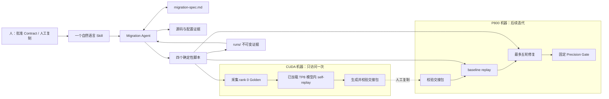

# Step-3.7-Flash 到 KLX P800 的 Spec 驱动算子迁移工具方案

> 文档状态：revision 4 方案设计；本地实现与测试不等于 CUDA/P800 实机通过
> 设计日期：2026-07-13
> 运行模式纠正：2026-07-17，target-only eager，不启用 EAGLE 或其他投机解码
> 算子边界纠正：2026-07-17，直接使用原始 `Step3p5MLP.forward`，TP8 模型中验证 rank 0，不新增模型函数
> 源码依据：SGLang `49e384ce9d304648e9959666ecb8ce8cd98d0deb`、SGLang-Kunlun `546ad8c682392922792bbbfe53a8bf575545f118`
> 背景材料：[自动化适配-推理](https://ku.baidu-int.com/knowledge/HFVrC7hq1Q/vMri-fRViV/G4ag4GvOr4/hro1tO5i3e6uj0)

## 1. 结论

最小 Demo 推荐做成一个 **Spec 驱动的单 Agent 闭环**：用户只调用 `$model-adaptation Step-3.7-Flash`；Migration Agent 每次行动前完整读取 `migration-spec.md`，根据其中唯一的 `next_action` 做判断；四个小脚本只承担可重复执行的采集、重放、交接校验和工作区保护；每次执行的详细证据放入不可变的 `runs/`。

闭环如下：

1. 在 decode 与 prefill 均禁用 CUDA Graph 的 eager 模式下，扫描 Step-3.7-Flash 实际经过的 target 模型路径，得到 CUDA 与 Kunlun 的算子缺口清单。
2. 只访问一次 CUDA 机器，在 SGLang 边界打桩；每个需要采集的算子最多保留三个不同调用形态的输入和 CUDA 输出。
3. 工具生成并校验交接包，人工把它复制到 P800。
4. P800 先用同一批输入做 baseline；只有实际执行失败或精度失败的候选才是真实 Operator Gap。
5. Agent 在最多五轮内修复一个真实缺口；每轮只验证一个假设，所有已采集样本都通过固定的 `torch.testing.assert_close` 门槛后结束。

这个设计把“目标、范围、门槛和当前进度”放在 Spec 中，避免 Agent 因对话变长或上下文压缩而忘记目标；同时不把 Agent 的源码理解和修复判断写成复杂工作流代码。

## 2. 目标与非目标

### 2.1 Demo 目标

- 固定 SGLang、SGLang-Kunlun、checkpoint 配置和 Demo 输入模式。
- 完整扫描实际 target 模型路径，不只扫描最后要修的一个算子。
- 记录扫描到的 CUDA/Kunlun 实现关系及所有缺口。
- 在唯一一次 CUDA Capture Session 中，为需要采集的缺口取得可在已加载模型中重放的 Golden Sample。
- 选择原始模型边界清楚、权重可由同一 checkpoint 提供、P800 baseline 真实失败的 Semantic Operator。
- 对该算子最多覆盖三个实际采到的 shape，且全部通过固定精度门槛。
- 自动修复最多五轮；最终补丁、命令、日志和逐样本结果可追溯。

### 2.2 非目标

- 不关闭 Step-3.7-Flash 的全部缺口，也不覆盖全部 shape。
- 不迁移整个 DecoderLayer，不完成模型组网、服务拉起、回复质量或 E2E logits 对齐。
- 不做吞吐、延迟或大 batch 性能优化。
- 不自动 SSH、上传、下载、登录或管理凭证；跨机器复制由人工完成。
- 不新增 C++、自定义 Kernel 或底层算子注册；需要这些能力时保存证据并停止。
- 不设计多 Agent 调度器、顶层编排 CLI、额外状态机或错误码体系。
- 不沿用或评审 `model-adaptation-agents` 的代码与架构。
- 本文不实现或运行 Demo，也不把纸面示例写成实机结论。

## 3. 设计原则

1. **Spec 是执行依据，不是一次性需求文档。** Agent 每次行动前都重读 Spec，动作结束后立即更新 Working State；聊天记录不作为恢复依据。
2. **模型负责判断，脚本负责重复动作。** 源码调用链、语义边界、缺口真假和修复假设由 Agent 判断；脚本不替 Agent 选算子或放宽门槛。
3. **一次 CUDA，后续都在 P800。** CUDA 只生成一次可复用 Golden；P800 的多轮修复不再依赖 N 卡在线服务。
4. **先证明是真缺口，再修复。** “没有 Kunlun 专用实现”不等于 correctness gap；P800 baseline 实际失败才进入修复。
5. **同一输入、固定门槛。** P800 重放使用 CUDA 采集的边界输入；精度门槛由人写入 Contract，Agent 和命令行都不能覆盖。
6. **失败证据保留，代码不累积污染。** 每轮从同一干净基线开始；失败 Run 保留，源码恢复基线；通过补丁是工作区唯一未提交修改。
7. **先做小闭环。** 最多三个实测 shape、一个真实缺口；不为“看起来更完整”提前引入 layer、E2E 或性能系统。

## 4. 核心术语

本文沿用仓库根目录 `CONTEXT.md` 的词汇，只列最关键的含义：

| 词 | 本文中的含义 |
|---|---|
| Migration Spec | `migration-spec.md`，同时保存人工批准的固定约束和 Agent 当前进度 |
| Contract | Spec 中人工拥有、Agent 只读的部分；定义目标、范围、门槛、权限和停止规则 |
| Working State | Spec 中 Agent 可更新的部分；记录当前阶段、活动算子、Run 指针和唯一下一动作 |
| Migration Agent | 唯一做判断的 Agent，负责读 Spec、分析源码、生成修复和推进状态 |
| Deterministic Tool | 四个职责单一的脚本；做采集、重放比较、交接校验或工作区保护，不做语义决策 |
| Semantic Operator | 可以单独采集输入输出、在所需模型状态中重放，并在 SGLang 调用点 Hook 的最小语义单元 |
| Operator Gap | CUDA 行为明确，但 P800 上缺失、无法执行或不能满足相同行为的 Semantic Operator |
| Golden Sample | 一次真实 CUDA 算子调用的边界输入、期望输出、必要参数和重放元数据；本 Demo 固定为 TP8 rank 0 |
| Run | 一次扫描、采集、校验、baseline 或修复尝试的不可变证据目录 |
| Repair Boundary | 只允许一个 Semantic Operator 的 Python、P800 Torch 或已有 xspeedgate/kunlun_ops 实现及其测试 |

`READY`、`CAPTURE_REQUIRED`、`NEEDS_HUMAN` 是扫描结论；`ACTIVE`、`WAITING`、`PASS`、`BLOCKED`、`NEEDS_HUMAN` 是执行状态。两者出现在不同字段中，不另建更细的状态体系。

## 5. 总体架构



### 5.1 为什么只有一个 Agent

扫描需要结合实际配置、Python 调用关系、插件替换和运行证据做判断，修复也需要从错误日志形成假设。把这些判断拆成多个 Agent 会增加交接状态，不能提升这个 Demo 的确定性。一个 Agent 只要每次从 Spec 恢复，就足以覆盖本闭环。

### 5.2 为什么没有顶层 CLI

首次创建 Spec、恢复执行和处理失败都需要理解上下文，不是简单参数编排。用户始终调用 `$model-adaptation <model>`；本 Demo 的参数固定为 `Step-3.7-Flash`。Skill 校验模型参数并读取 Spec，再让 Agent 执行唯一下一动作。四个脚本是 Agent 的工具，不是用户需要记忆的工作流入口。

## 6. 包结构与运行目录

### 6.1 Skill 包

```text
model-adaptation/
├── SKILL.md
├── references/
│   └── migration-spec-template.md
└── scripts/
    ├── capture_golden.py
    ├── replay_compare.py
    ├── handoff_bundle.py
    └── workspace_guard.py
```

`SKILL.md` 描述如何校验模型参数、创建/读取 Spec、调用脚本、读取 `result.json` 和更新 Working State。`references/migration-spec-template.md` 只在首次创建 Spec 时读取。Skill 不复制完整历史，也不实现一个隐藏的工作流引擎。

### 6.2 运行工作区

```text
<migration-workspace>/
├── migration-spec.md
└── runs/
    ├── scan-001/
    ├── golden-001/
    ├── handoff-verify-001/
    ├── baseline-001/
    └── repair-001/ ... repair-005/
```

运行时不设置 `outputs/`。本文位于 `outputs/`，只是当前方案设计任务的交付位置，不是迁移工具的目录约定。

交接包是人工跨机器复制的临时载体，不是第三份状态目录。工具把 `migration-spec.md`、被引用的 Golden Run 和 `manifest.json` 组装到一个由动作参数指定的 bundle 目录；P800 先校验这份只读载体，成功后再从其中的 `migration-spec.md + runs/` 初始化运行工作区。后续 Working State 更新不回写已校验的 bundle。

## 7. Migration Spec 设计

### 7.1 一个文件、两个所有权区

```text
migration-spec.md
├── Contract                 # 人工拥有，Agent 只读
│   ├── Contract Data JSON   # 四个脚本唯一解析的部分
│   ├── Goal / Demo Closure
│   ├── Precision Gate
│   ├── Authority / State / Recovery
│   └── Human Decisions
└── Working State            # Agent 更新
    ├── Current
    ├── Scan / Gap queue
    ├── CUDA Capture / Handoff
    ├── P800 Repair
    └── Stop reason / Decisions
```

Contract 与 Working State 使用明确的注释边界。人工修改 Contract 时必须递增 `contract_revision` 并记录原因。Agent 不得修改 Contract，也不能把 Working State 中的临时发现反写成固定门槛。

### 7.2 Contract Data JSON

四个脚本不解析 Contract 的 Markdown 语义，也不读取 Working State。建议在 Contract 内用固定的开始/结束标记包住一段原始 JSON；两个标记之间只能有一个 JSON 对象。脚本只提取这段字节并调用 JSON 解析器：

```text
<!-- CONTRACT-DATA: BEGIN -->
{
  "schema": "migration-spec/v0",
  "spec_id": "step3p7-flash-p800-demo",
  "contract_revision": 4,
  "model": "Step-3.7-Flash",
  "source": {
    "sglang_revision": "<approved revision>",
    "sglang_kunlun_revision": "<approved revision>"
  },
  "checkpoint": {
    "id": "<checkpoint id/revision>",
    "config_digest": "<sha256>"
  },
  "model_path": {
    "target_entry": "Step3p7ForConditionalGeneration.forward",
    "draft_entry": null
  },
  "operator_boundary": {
    "id": "Step3p5MLP.forward",
    "activation_guard": "self.limit is not None",
    "tp_rank": 0
  },
  "runtime": {
    "tensor_parallel_size": 8,
    "dtype": "bfloat16",
    "quantization": null,
    "speculative_algorithm": null,
    "cuda_graph_backend_decode": "disabled",
    "cuda_graph_backend_prefill": "disabled",
    "attention_backend": null
  },
  "demo_input_mode": "<approved mode>",
  "limits": {
    "max_shapes_per_operator": 3,
    "max_repair_attempts": 5
  },
  "precision_gate": {
    "comparator": "torch.testing.assert_close",
    "atol": 0.01,
    "rtol": 0.02,
    "require_exact_structure": true,
    "require_same_dtype": true,
    "require_finite": true,
    "check_stride": false
  }
}
<!-- CONTRACT-DATA: END -->
```

模板阶段允许用 JSON `null` 表示未决定；初次批准前，所有未决必填值必须换成实际值。`draft_entry`、`runtime.quantization`、`runtime.speculative_algorithm` 与 `runtime.attention_backend` 的 `null` 是本 Demo 有意固定的“路径不启用或命令不传该参数”，不是占位；`atol`、`rtol` 固定为人批准的 `0.01`、`0.02`。

运行期信息不进入 Contract Data，例如当前 Run、当前算子、Golden Run、执行站点、bundle 路径和 worktree 路径。这些是动作参数或 Working State，避免人每执行一步就修改 Contract。

### 7.3 Contract 绑定

每个脚本启动时只读取一次 Contract Data，并对规范化 JSON 计算 SHA-256。规范化字节固定为 `json.dumps(data, sort_keys=True, separators=(",", ":"), ensure_ascii=False).encode("utf-8")`，避免四个脚本各自使用不同格式。每个可信 `result.json` 都记录：

```json
{
  "spec_binding": {
    "spec_id": "step3p7-flash-p800-demo",
    "contract_revision": 4,
    "contract_data_sha256": "<sha256>"
  }
}
```

不绑定整份 `migration-spec.md` 的摘要，因为脚本结束后 Agent 会更新 Working State；若绑定整份文件，正常的状态更新也会让结果失效。Agent 接收结果时必须重新计算 Contract Data 摘要；三项任一不一致，结果不得推进状态。

### 7.4 Contract 正文必须固定的规则

- 目标、Demo Closure 和非目标。
- Skill 调用参数中的模型名，以及 SGLang/SGLang-Kunlun revision、checkpoint、配置摘要、TP8、BF16、target-only eager 和输入模式。CUDA 与 P800 使用同一组启动参数：不传量化或投机解码参数，不额外传 MTP 开关，不显式传 attention backend；运行后解析出的两端实际 backend 只作为 Run 证据保存。
- eager 的含义是 decode 与 prefill CUDA Graph backend 都为 `disabled`。不使用 `--debug-cuda-graph` 或 `cuda_graph_tc_compiler=eager` 代替，因为它们仍属于 CUDA Graph 路径。
- 只允许一个 CUDA Capture Session；`Step3p5MLP.forward` 只验证 TP8 rank 0，最多三个 shape。
- `max_repair_attempts = 5`，baseline 不计数，通过轮计数。
- Precision Gate 固定使用 `torch.testing.assert_close`、`atol=0.01`、`rtol=0.02`。
- Repair Boundary 和人工跨机器复制边界。
- 允许的状态迁移、停止条件和 Recovery protocol。
- 人工决定记录；任何 Contract 变化都递增 revision。

### 7.5 Working State 最小字段

| 区域 | 必要字段 | 作用 |
|---|---|---|
| Current | `observed_contract_revision`、`state_revision`、`status`、`phase`、`execution_site` | 判断当前 Spec 是否与 Contract 对齐 |
| Current | `active_operator`、`last_completed_action`、`last_run`、`next_action` | 上下文压缩后恢复唯一下一步 |
| Scan | `scan_run`、target coverage、算子计数、gap queue | Spec 只存摘要，完整清单留在 Scan Run |
| CUDA Capture | `capture_session_id`、session status、`golden_run`、样本计数 | 保证 CUDA Session 只创建一次 |
| Handoff | bundle status/path、`manifest_path`、P800 校验 Run | 表达人工交接点 |
| P800 Repair | `baseline_run`、`attempts_used`、`active_hypothesis`、`passing_run` | 恢复有限轮修复 |
| Stop | `stop_reason`、`human_question`、是否需要 Contract revision | 说明为什么停止和怎样恢复 |

`ACTIVE` 时 `next_action` 必须恰好一条；`WAITING` 时它是一条人工复制动作；终止状态下为 `none`。修复细节不堆进 Spec，完整补丁、命令和比较结果都在 Run。

### 7.6 Bootstrap 与恢复

首次调用 `$model-adaptation Step-3.7-Flash` 时：

1. Skill 校验模型参数；如果 `migration-spec.md` 不存在，Agent 生成骨架，把 `Step-3.7-Flash` 写入 Contract Data 的 `model`，并尽量填充其他 Contract 字段。
2. 仍有未决值时，写为 `NEEDS_HUMAN / SCAN` 并停止，不能先扫描后补 Contract。
3. 人工补齐并批准后，写入 `contract_revision: 1` 和初始 Human Decision。
4. 再次用同一模型参数调用 Skill，Agent 校验参数、Contract 和 Working State 后进入 `ACTIVE / SCAN`。

上下文压缩或换 Agent 后只做以下恢复动作：完整读 Contract；核对 revision；读 Current、活动算子、上一 Run 和其证据；校验 `status/phase`；只执行 `next_action`。若 Spec 自相矛盾、证据指针失效或下一动作不唯一，进入 `NEEDS_HUMAN`，不猜测继续。

## 8. 状态与停止条件

### 8.1 两个状态维度

`phase` 表示正在做哪一段工作：

- `SCAN`
- `CUDA_CAPTURE`
- `HANDOFF`
- `P800_REPAIR`
- `DONE`

`status` 表示能否继续：

| status | 含义 | 当前 Agent 是否停止 |
|---|---|---|
| `ACTIVE` | 可以按唯一 `next_action` 继续 | 否 |
| `WAITING` | 等待计划内的人工复制 | 是，复制并校验后可直接恢复 |
| `PASS` | Demo Closure 已满足 | 是，且不再恢复 |
| `BLOCKED` | 原因明确，但继续会越过范围、权限、环境或次数上限 | 是 |
| `NEEDS_HUMAN` | 缺少人类决定，或 Agent 无法可靠确定边界/下一步 | 是 |

`WAITING` 只用于人工跨机器复制。普通失败不进入 `WAITING`；需要人做选择也不使用 `WAITING`。

### 8.2 主要迁移

| 当前状态 | 条件 | 下一状态或动作 |
|---|---|---|
| `ACTIVE / SCAN` | target-only eager 扫描完成，无未决边界，存在采集候选 | `ACTIVE / CUDA_CAPTURE` |
| `ACTIVE / SCAN` | 调用关系或边界无法可靠确定 | `NEEDS_HUMAN / SCAN` |
| `ACTIVE / SCAN` | 固定范围内没有可用于 Demo 的候选 | `BLOCKED / SCAN` |
| `ACTIVE / CUDA_CAPTURE` | 唯一 Session、self-replay 和 bundle CUDA 端校验均通过 | `WAITING / HANDOFF` |
| `ACTIVE / CUDA_CAPTURE` | 唯一 Session 已消耗但无法形成有效 Golden | `BLOCKED / CUDA_CAPTURE`，禁止重开 Session |
| `WAITING / HANDOFF` | bundle 在 P800 通过 manifest 校验 | `ACTIVE / P800_REPAIR` |
| `ACTIVE / P800_REPAIR` | 某候选 baseline 全部样本通过 | 它不是真 gap，换下一个已采集候选，不消耗次数 |
| `ACTIVE / P800_REPAIR` | 所有候选 baseline 都通过 | `BLOCKED / P800_REPAIR`，原因是没有真实 gap |
| `ACTIVE / P800_REPAIR` | 某候选 baseline 任一样本执行或精度失败 | 选为真实 gap，`attempts_used=0`，开始修复 |
| `ACTIVE / P800_REPAIR` | 本轮失败且未到五轮 | 保存 Run、恢复基线、形成下一条单一假设 |
| `ACTIVE / P800_REPAIR` | 所有样本通过且 Closure 完整 | `PASS / DONE` |
| `ACTIVE / P800_REPAIR` | 需要新 C++/Kernel 注册，或第五轮仍失败 | `BLOCKED / P800_REPAIR` |
| 任意 `ACTIVE` | Spec 不一致、未知工作区修改、下一动作不唯一 | `NEEDS_HUMAN / 当前 phase` |

`BLOCKED` 或 `NEEDS_HUMAN` 只有在人更新 Contract、递增 `contract_revision` 并记录解决决定后才能恢复。不能只改 Working State 绕过原有停止条件。

### 8.3 主路径时序

| 步骤 | 位置 | 关键动作 | 完成后的状态 |
|---|---|---|---|
| 0 | 源码侧 | 创建并人工批准 Contract | `ACTIVE / SCAN` |
| 1 | 源码侧 | 扫描 target-only eager 路径，形成完整 Scan Run 和 gap queue | `ACTIVE / CUDA_CAPTURE` |
| 2 | CUDA | TP8 模型中直接 Hook 原始 `Step3p5MLP.forward`，rank 0 最多采集三个 shape | 仍为 `ACTIVE / CUDA_CAPTURE` |
| 3 | CUDA | 已加载同一 checkpoint 的 TP8 模型在 rank 0 self-replay 全部 Golden Samples | Golden Run `SEALED` |
| 4 | CUDA | 用下一状态 Spec 构建并校验 bundle，原子进入交接点 | `WAITING / HANDOFF` |
| 5 | 人工 | 把 bundle 从 CUDA 机器复制到 P800 | 仍为 `WAITING / HANDOFF` |
| 6 | P800 | 校验 manifest，初始化运行工作区 | `ACTIVE / P800_REPAIR` |
| 7 | P800 | 对候选逐个做 baseline，选出真实失败的一个 | `attempts_used=0` |
| 8 | P800 | 每轮从同一基线验证一个假设，最多五轮 | 失败则继续或 `BLOCKED` |
| 9 | P800 | 全部实际样本通过固定 Precision Gate | `PASS / DONE` |

## 9. 阶段一：真实路径扫描

### 9.1 扫描根

Agent 先读取固定 checkpoint 的加载后配置，再建立 target 模型内调用树：

```text
target:
Step3p7ForConditionalGeneration.forward
  -> general_mm_embed_routine
  -> Step3p5ForCausalLM.forward
  -> Step3p5Model.forward
  -> Step3p5DecoderLayer.forward
  -> Attention + MLP/MoE
```

源码中，Step-3.7 把 `Step3p5ForCausalLM` 作为语言模型，并通过多模态通用流程进入它。Contract 不启用投机解码，所以扫描到 target 的 Attention、MLP/MoE 和 logits 边界后停止，不进入 `Step3p5MTP`。

Worker、Runner、采样树、批次调度和 CUDA Graph 管理只用于证明怎样进入模型，不进入算子枚举。扫描进入模型后，沿当前配置和输入实际激活的 `forward` 分支下钻；到达具有明确输入输出、可在所需模型状态中重放且可被 Hook 的 Semantic Operator 后停止继续拆分。

### 9.2 为什么不实现 `scan.py`

纯 AST 无法可靠处理加载后配置分支和插件在启动时替换函数绑定。最小实现由 Agent 使用代码搜索、配置证据和模型推理形成扫描结论；不把这些判断固化成一组易失效的正则或规则。Scan Run 只需保存 Agent 生成的结构化结果和源码锚点。

### 9.3 每个扫描记录

| 字段 | 内容 |
|---|---|
| `operator_id` | 稳定的语义边界标识，不用底层 Kernel 名代替 |
| `model_path` | target 及从真实入口到该算子的调用链 |
| `activation_guard` | 实际使分支生效的配置、层号、forward mode 或输入条件 |
| `boundary` | 输入、输出、非 Tensor 参数、状态/权重依赖和调用点 |
| `cuda_impl` | CUDA 侧实际实现锚点及类型 |
| `kunlun_impl` | Kunlun 侧共享实现、plugin、xspeedgate/kunlun_ops 或缺失锚点 |
| `replay_replace_check` | 是否能单独采集、重放和替换；失败时缺什么 |
| `verdict` | `READY`、`CAPTURE_REQUIRED` 或 `NEEDS_HUMAN`，附证据理由 |

判定口径：

- `READY`：现有 P800 可执行实现的语义覆盖可以从证据确认。
- `CAPTURE_REQUIRED`：CUDA 路径明确，但 Kunlun 缺失、依赖 CUDA-only 路径，或必须用真实 CUDA 输出固定语义。
- `NEEDS_HUMAN`：实际分支、调用关系或最小可替换边界仍无法唯一确定。

同名实现不自动等于 `READY`；没有专用 Kunlun Kernel 也不自动等于缺口。Scan Run 必须同时保留 CUDA 与 Kunlun 两侧证据。

### 9.4 Scan Run

```text
runs/scan-001/
└── result.json
```

`result.json` 保存固定 revisions、checkpoint config 摘要、输入模式、target-only eager 覆盖结论、完整 operator 列表和每条源码证据。Working State 只保留覆盖计数、gap queue 与该 Run 指针。

扫描发现的 `CAPTURE_REQUIRED` 项都必须进入唯一 Capture Session 的计划。若某项在禁止采集权重或运行时对象的前提下不能形成可重放边界，不能静默跳过；应在 Session 前进入 `NEEDS_HUMAN`，或由人修改 Contract 范围。

## 10. 阶段二：一次性 CUDA Golden Capture

### 10.1 为什么输入和输出 Tensor 都要保存

只保存 CUDA 输出，P800 没有相同输入就无法离线重放；只保存输入，又没有固定的期望输出可做精度判断。因此最小 Golden Sample 必须同时包含边界输入 Tensor 和 CUDA 期望输出 Tensor。

不需要保存全部上下文。默认不保存：checkpoint 权重、`nn.Parameter`、module state、内部中间 Tensor、完整 batch、prompt/token、KV cache、stream/handle、随机状态和凭证。`limit`、`epsilon` 等真正参与算子语义的标量按非 Tensor 参数写入元数据。

### 10.2 Golden Sample 最小内容

| 类别 | 最少内容 |
|---|---|
| 绑定 | `spec_binding`、`operator_id=Step3p5MLP.forward` |
| 模型位置 | `model_instance_path`、`tp_rank=0`、`tensor_parallel_size=8`、执行阶段 |
| 输入 | CPU BF16 `x` 数值，以及 shape、dtype、layout、stride |
| 非 Tensor 参数 | 标量 `limit` |
| 输出 | CPU BF16 CUDA Golden `output` |
| 去重 | `capture-state.json` 中输入 `x` 的 shape ID 及计数 |
| 外部证据 | checkpoint、源码 revision、Hook 目标和启动参数保存在 Run 配置与日志，不重复写入每份样本 |

如果正确行为依赖共享存储、原地修改、随机状态或无法稳定表示的运行时对象，该候选不满足当前数据契约，不能为了采它临时扩大 dump 范围。

### 10.3 去重规则

本 Demo 只对输入 `x` 的 shape 计算稳定 SHA-256。shape 相同就算同一种，即使它再次出现在另一个模型层、prefill 或 decode；首次出现的记录保留模型层路径、执行阶段、dtype、layout、stride 和 `limit` 作为重放定位与校验元数据。前三种新 shape 保存 Tensor，第四种及以后只记未保留计数。若只观察到一种或两种真实 shape，就只验收这些样本，不能用随机 shape 补满三种。

### 10.4 Golden Run 与模型内 self-replay

```text
runs/golden-001/
├── result.json
├── capture.log
├── capture-state.json
├── samples/
│   ├── <shape-id-1>.pt
│   ├── <shape-id-2>.pt
│   └── <shape-id-3>.pt
└── self-replay/
    ├── result.json
    └── replay.log
```

每份样本只包含 rank 0 的 `x`、CUDA `output`、`limit`、模型层路径和布局元数据。权重不进入样本，由同一 checkpoint 在当前 rank 加载。Capture 结束后，先停止采集进程；`prepare-model-replay` 原子地关闭样本写入，但保持 Session 为 `ACTIVE`。随后在仍可使用 CUDA 的同一次 Session 内加载同一 checkpoint 的 TP8 模型，在相同 `Step3p5MLP` 实例上重放 `x`。插件必须把 SGLang 实际生效的 model path 与 revision 和 Contract checkpoint 核对；缺失或不一致直接停止。`replay-result.json` 生成后先停止 replay 模型进程，再执行 finalize；初始化和 finalize 都重新核对 Contract Precision Gate，并要求配置中的 shape/模型路径与 `capture-state.json` 完全相同。每条结果必须严格对应一个配置项，且顶层 `passed` 必须等于所有逐条结果的合取。finalize 先写入可校验的 self-replay 证据，再发布最终结果；任一步中断后都可用同一证据重试。所有保留样本通过后，Golden Run 才能标记为 `SEALED`，失败则标记为 `FAILED`。不能把 MLP 退化成无权重函数调用。

当前源码在 active CUDA Graph capture 时会跳过 Tensor dump，因此 Contract 明确把 decode 与 prefill CUDA Graph 都设为 `disabled`，并选择允许安全落盘的函数边界。不能在 active graph capture 中强行复制 Tensor。

### 10.5 Tensor 序列化

当前最小实现使用 `torch.save` 保存 CPU BF16 `x/output`，读取时使用 `torch.load(..., weights_only=True)`。格式仍必须在真实 CUDA 与 P800 修改版 Torch 环境中完成一次人工复制后的 round-trip：两端都能读写，dtype、shape 和必要布局能按约定重建，异常文件能被拒绝，并记录两端 Torch 版本。本地测试通过不能替代这项实机证据。

## 11. 阶段三：Handoff Bundle

### 11.1 内容

```text
<bundle>/
├── migration-spec.md
├── runs/<golden-run-id>/...
└── manifest.json
```

Spec 是进入 `WAITING / HANDOFF` 时的完整副本；Golden Run 必须已经通过 CUDA self-replay。bundle 不需要额外 README，下一动作在 Spec，命令和结果在 Run。

为避免“先生成 manifest，随后更新 Spec 又让 manifest 失效”，bundle 构建和进入 `WAITING` 作为一个原子动作处理：Agent 先生成一份下一状态的 Spec 临时副本，其中已经写好 `WAITING / HANDOFF`、最终 bundle/manifest 路径和人工复制动作；`handoff_bundle.py` 先确认临时副本与当前 Spec 的 Contract Data 完全相同，再用这份精确字节构建并校验 bundle；成功后 Agent 用同一份字节原子替换运行工作区的 Spec 并停止。若构建失败，当前 Spec 仍保持可恢复的 `ACTIVE` 状态。临时副本只是动作文件，不增加新的状态来源。

### 11.2 完整性校验

`manifest.json` 对自身之外的每个文件记录按字典序排列的相对路径、字节数和 SHA-256。禁止绝对路径、`..` 和符号链接。工具在 CUDA 端生成后校验一次，人工复制后在 P800 再校验一次；文件缺失、多出、大小或摘要不一致时，任何 Golden Tensor 都不得使用。

Spec 只保存 `manifest_path`，不保存 manifest digest，避免 manifest 包含 Spec、Spec 又包含 manifest digest 的自引用。两端可以各自输出 manifest 文件本身的 SHA-256，供人工比对。

工具负责生成和校验，人工只负责复制。P800 端先在未修改的 bundle 上完成校验，再用其中的 `migration-spec.md + runs/` 初始化工作区；原 bundle 保留为交接证据。manifest 不提供数字签名或身份认证，它只证明复制前后字节是否一致。

## 12. 阶段四：P800 baseline 与有限轮修复

### 12.1 baseline 先证明缺口

P800 校验 bundle 后，对候选算子的全部 Golden Samples 依次重放：

- 全部样本执行成功且通过 Precision Gate：它不是 correctness gap，换下一个已经采集的候选；不回 CUDA，也不消耗修复次数。
- 任一样本无法执行或精度失败：它是本 Demo 可修复的真实 Operator Gap；记录 baseline Run，`attempts_used` 仍为 `0`。
- 所有已采集候选都通过：进入 `BLOCKED`，如实说明“没有真实 gap”，不能把缺少专用优化当作迁移成果。

### 12.2 每轮补丁生命周期

1. 每轮开始前校验 SGLang 与 SGLang-Kunlun 仍是 Contract 固定基线，且不存在无法解释的修改。
2. Agent 从已有 evidence 写一条且仅一条 `active_hypothesis`。
3. 修改代码前先创建本轮 Run，将 `attempts_used` 加一，并让 `last_run` 指向它；通过轮也计数。
4. 本轮生成一份相对同一基线的完整候选补丁，重放全部样本。
5. 失败时先封存 Run，再恢复固定基线；下一轮可以读失败证据，但不继承失败工作区。
6. 通过时把该 Run 写入 `passing_run`，并将其补丁作为工作区唯一未提交修改保留。

工具不建分支、不切分支、不 commit、不 push。若开始前已有未知修改，进入 `NEEDS_HUMAN`，不能替用户清理。若恢复后仍有无法解释的修改，也必须停止。

### 12.3 Repair Boundary

允许：

- P800 可执行的 Python；
- 用户实际环境可执行的修改版 PyTorch API；
- 已有 xspeedgate/kunlun_ops 能力；
- 对活动 Semantic Operator 的聚焦 replay 测试。

不允许：

- 新 C++、自定义 Kernel、底层注册；
- 扩大到 DecoderLayer 或模型组网；
- 修改 Precision Gate；
- 为通过测试而 skip 某个 Golden Sample。

若下一条可信假设必须越过边界，保存已有证据、恢复基线并进入 `BLOCKED`；不必耗尽五轮。第五轮仍失败时同样 `BLOCKED`，不得开始第六轮。

## 13. Migration Agent 与四个脚本的职责

### 13.1 职责划分

| 组件 | 负责 | 不负责 |
|---|---|---|
| Migration Agent | 读 Spec、扫描源码、判断边界与缺口、选择候选、形成单一修复假设、生成补丁、更新 Working State | 修改 Contract、放宽门槛、自动跨机器复制 |
| `capture_golden.py` | 直接 Hook 原始 `Step3p5MLP.forward`、rank 0 过滤、调用签名去重、保存最多三个 shape、记录采集环境 | 修改 SGLang 模型源码、判断哪个算子是真缺口、决定第二次 Session |
| `replay_compare.py` | 准备和收口已加载 TP8 模型内的 rank 0 self-replay；P800 baseline/repair replay；固定精度比较 | 选择容差、选择下一轮假设、更新 Spec |
| `handoff_bundle.py` | 构建 manifest；CUDA/P800 两端校验文件集合、大小与 SHA-256 | 上传、下载、SSH、凭证管理 |
| `workspace_guard.py` | 校验固定干净基线、保存完整 patch、失败恢复、验证通过补丁是唯一修改 | 建分支、commit、push、清理未知用户修改 |

### 13.2 统一接口

四个脚本都有两个必选参数：

```text
--spec migration-spec.md
--run-dir runs/<run-id>
```

动作信息继续显式传入，不写入 Contract Data：

| 脚本 | 最少的动作参数 |
|---|---|
| `capture_golden.py` | Capture plan、框架启动命令/参数 |
| `replay_compare.py` | `cuda-self-replay` / `p800-baseline` / `p800-repair` 模式、Golden Run、operator id |
| `handoff_bundle.py` | `build` / `verify` 模式、bundle 目录、Golden Run；build 时接收 Agent 生成的下一状态 Spec 临时副本 |
| `workspace_guard.py` | `check` / `record-patch` / `restore` / `verify-passing` 动作、相关 worktree |

Capture plan 只是本次动作输入，列出 `operator_id`、经 Agent 确认的 qualified hook target 和运行命令；它不决定扫描结论，也不成为第二个状态文件。

脚本不得提供 `--atol`、`--rtol`、`--max-samples` 或 `--max-repair-attempts` 等覆盖固定 Contract 的参数。运行模式、当前 Golden 路径和当前算子属于动态动作参数，可以显式传入。

### 13.3 `result.json` 约定

每个脚本只向本次 Run 写文件，不读写 Working State。成功形成可信结果时，`result.json` 至少包含：

```json
{
  "tool": "replay_compare.py",
  "action": "p800-baseline",
  "spec_binding": {
    "spec_id": "step3p7-flash-p800-demo",
    "contract_revision": 1,
    "contract_data_sha256": "<sha256>"
  },
  "passed": false,
  "summary": "<human-readable summary>",
  "evidence": ["samples/sample-001/compare.json", "replay.log"]
}
```

退出码 `0` 表示脚本完成了动作并形成可信 `result.json`；其中 `passed: false` 可以是一次有效的 baseline/精度失败。非零退出只表示脚本本身未完成，例如 Spec JSON 无效、文件读失败或结果无法落盘；它不能直接证明 Operator Gap。Agent 必须先校验 Spec 绑定，再根据结果语义更新 Working State。

## 14. Precision Gate 与比较器

### 14.1 固定判定顺序

用户已经在 P800 实机验证 `torch.testing` 可用，因此不设计 Torch/NumPy 多后端适配层。每个样本按以下顺序判断：

1. 从 Contract Data 读取固定 `atol`、`rtol`。
2. 从 Golden Sample 读取 expected output 和结构元数据。
3. 检查实际输出的容器类型、长度、dict keys 和 Tensor 叶子路径完全一致。
4. 检查对应 Tensor 的 shape、dtype 一致，非 Tensor 叶子按原值相等。
5. 检查 expected 与 actual 的所有数字 Tensor 都是有限值。
6. 两端 Tensor 保持原 dtype 复制到 CPU。
7. 对每个 Tensor 叶子调用：

```python
torch.testing.assert_close(
    actual_cpu,
    expected_cpu,
    atol=contract.atol,
    rtol=contract.rtol,
    equal_nan=False,
    check_device=True,
    check_dtype=True,
    check_layout=True,
    check_stride=False,
)
```

需要先独立检查结构，是因为 PyTorch 允许 list 与 tuple 只要长度和元素匹配就通过；需要先检查有限值，是因为同位置相同的正负无穷可能被视为接近。[PyTorch 官方文档](https://docs.pytorch.org/docs/2.12/testing.html)也要求显式指定容差时同时给出 `atol` 和 `rtol`。

### 14.2 比较结果

每个样本保存一个 `compare.json`，最少记录：

- sample id、P800 Torch 版本和实际使用的 Precision Gate；
- 结构、shape、dtype、有限值检查结果；
- 每个 Tensor 叶子的 shape、dtype、PASS、最大绝对差、不匹配数量；
- 原始 `AssertionError` 文本或执行异常；
- 样本总结果。

最大差、数量和异常文本只帮助 Agent 形成下一轮假设，不构成第二套门槛。一个 Run 只有在该算子的所有已保留 Golden Samples 都通过时才通过，不允许 skip。

P800 actual output 只在本次 replay 进程内存中使用，不额外保存 Tensor。Run 已保存 Golden 输入指针、命令、patch、日志和比较诊断；需要复查时可以在同一台 P800 再次重放，避免最多五轮重复保存大 Tensor。

## 15. 首选候选：特殊 SwiGLU

### 15.1 原始算子边界

当前固定源码直接使用模型原始 `Step3p5MLP.forward`：

```python
def forward(self, x):
    if self.limit is not None:
        gate_up, _ = self.gate_up_proj(x)
        gate, up = gate_up.chunk(2, dim=-1)
        gate = F.silu(gate)
        gate = gate.clamp(min=None, max=self.limit)
        up = up.clamp(min=-self.limit, max=self.limit)
        output, _ = self.down_proj(gate * up)
    ...
    return output
```

边界输入是 `x`，边界输出是 `output`。它覆盖 `gate_up_proj`、特殊 SwiGLU 和 `down_proj`，因此重放依赖同一 checkpoint、TP8 和当前 rank 的权重分片。Golden Sample 不保存权重，也不保存 `gate_up`、`gate`、`up` 等内部 Tensor。

扫描器可以继续深入这个方法判断 CUDA/Kunlun 的差异，但最终缺口归到 `Step3p5MLP.forward`。不得为了打桩修改 SGLang 源码，不得新增模型算子函数，也不得把内部表达式升级成独立算子。

### 15.2 为什么最小 Demo 只保存 rank 0

特殊 SwiGLU 位于 MoE 层的 `share_expert`，创建时使用 `reduce_results=False`。因此 `Step3p5MLP.forward` 返回当前 TP rank 的局部结果，后续才与 MoE 输出相加并进行 all-reduce。该边界包含 TP 分片权重，但在这个配置下不包含必须由八个 rank 同时完成的归约。

为保持最小工具，Contract 固定 `operator_boundary.tp_rank=0`：

- CUDA 与 P800 都加载相同 checkpoint 的 TP8 模型；
- 只有 rank 0 保存和重放，其他 rank 不额外落盘或比较；
- 每种 shape 保存一份 `x` 和一份 rank 0 CUDA `output`；
- 这个 Demo 证明原始算子边界的自动化流程，不声称八个权重分片全部通过。

### 15.3 成为 Demo 对象的三个条件

特殊 SwiGLU 只有同时满足以下事实才有资格进入修复：

1. 固定 checkpoint 的加载后配置证明，target 路径对应 `Step3p5MLP` 实例的 `self.limit` 非空。
2. 唯一 CUDA Session 已在原始 `Step3p5MLP.forward` 边界采到 rank 0 的一至三个真实 shape。
3. P800 rank 0 baseline 在已加载同一 checkpoint 的对应实例上至少有一个执行或精度失败。

若配置未激活，它不属于本次实际路径；若 baseline 全部通过，它不是 correctness gap。此时只能改选同一 Session 已采集的其他候选；没有其他候选时应如实记录“没有真实 gap”并停止，不重新访问 CUDA，也不伪造失败。

### 15.4 三个 shape 的纸面表示

| Sample | 模型实例 | rank | 输入 | CUDA 期望输出 | 必要标量 |
|---|---|---|---|---|---|
| `sample-001` | `<layer-path>` | `0/8` | `x: [T1, H]` | `output: [T1, H]` | `limit=L1` |
| `sample-002` | `<layer-path>` | `0/8` | `x: [T2, H]` | `output: [T2, H]` | `limit=L2` |
| `sample-003` | `<layer-path>` | `0/8` | `x: [T3, H]` | `output: [T3, H]` | `limit=L3` |

`T1/T2/T3/H/L1/L2/L3` 都是符号，不是模型事实。真实值和模型层路径必须来自 Capture Session。

## 16. 最小产物契约

### 16.1 通用 Run 规则

- 一个 Run 对应一次明确动作；创建后只追加本动作文件，封存后不可修改。
- 所有路径相对运行工作区记录，不把某台机器的绝对路径写成跨机器契约。
- 所有脚本结果绑定同一 Contract Data。
- 日志不得保存凭证或完整无关环境变量。

### 16.2 Run 类型

| Run | 最少产物 |
|---|---|
| Scan | `result.json`：完整算子记录、两侧实现证据、覆盖结论 |
| Golden | `result.json`、capture log、样本 metadata/input/expected output、self-replay 结果 |
| Handoff verify | `result.json`：文件集合、大小、SHA-256、manifest 自身摘要 |
| P800 baseline | `result.json`、replay log、逐样本 `compare.json` 或执行异常 |
| P800 repair | `result.json`、完整 `candidate.patch`、replay log、逐样本 `compare.json` |

修复 Run 示例：

```text
runs/repair-003/
├── result.json
├── candidate.patch
├── replay.log
└── samples/
    ├── sample-001/compare.json
    ├── sample-002/compare.json
    └── sample-003/compare.json
```

## 17. 端到端 Demo 验收

只有以下条件全部成立，Working State 才能写为 `PASS / DONE`：

1. Contract 已由人批准，所有必填值已填写，四个脚本使用的 Contract Data 绑定一致。
2. 固定 checkpoint 与输入模式下，target-only eager 实际模型路径扫描完成；每个结论都有源码或运行证据。
3. 所有发现的 Operator Gap 都进入 gap queue，所有 `CAPTURE_REQUIRED` 项均纳入唯一 CUDA Session；任何一项无法按 Contract 采集时都必须停止，不能静默遗漏后继续写 PASS。
4. 唯一 CUDA Session 为 `Step3p5MLP.forward` 最多保留三个不同真实 shape，rank 0 的 `x` 和 CUDA `output` 均已保存，权重与内部 Tensor 未进入样本。
5. Golden Run 在已加载同一 checkpoint 的 CUDA TP8 模型 rank 0 上全部 self-replay 通过，bundle 在 CUDA 与 P800 两端校验通过。
6. 被选作 Demo 的算子在 P800 baseline 中真实失败；没有用“缺少专用优化”代替失败证据。
7. 修复没有越过 Repair Boundary；baseline 不计数，修复不超过五轮，通过轮计数。
8. 该算子的所有已采集样本均通过结构、shape、dtype、有限值和固定 `torch.testing.assert_close` 门槛。
9. `passing_run` 指向通过 Run；其完整补丁是 P800 工作区唯一未提交修改；所有失败 Run 可追溯。
10. `next_action=none`，Closure checklist 指向上述证据。

以下内容不影响本 Demo PASS：其他缺口尚未修复、没有覆盖第四种以后 shape、没有完整模型回复、没有 E2E logits 或性能数据。

## 18. 未验证假设与风险

| 项目 | 当前状态 | 方案处理 |
|---|---|---|
| Tensor 序列化格式 | 未决定 | 实现前在真实 CUDA/P800 做一次跨端读写验证，再固化格式 |
| 最终 SGLang revision | revision 4 已固定原始 CUDA `49e384ce...` 与 Kunlun `546ad8c68...` | 两端都使用原始 `Step3p5MLP.forward`，不得增加模型函数 |
| 实际 checkpoint 是否激活特殊 SwiGLU | 未取得加载后配置证据 | SCAN 阶段读取并保存 config 摘要；未激活则换候选 |
| 特殊 SwiGLU 是否在 P800 真失败 | 未验证 | 只由 P800 baseline 决定；全通过则不能进入修复 |
| `torch.testing` 在 P800 可用 | 用户已实机确认 | 直接使用；Run 仍记录实际 Torch 版本和比较参数 |
| CUDA Graph 未按 Contract 关闭 | 现有 SGLang dump 会跳过 | 启动前校验 decode/prefill 都是 `disabled`；不能在 graph capture 内强行采集 |
| 原始 MLP Hook 可达性 | 本地已用固定源码的真实 `HookRegistry` 验证 | N 卡 preflight 重跑同一聚焦测试，正式证据仍需实机 |
| rank 0 代表性范围 | 不覆盖另外七个权重分片 | 当前 Demo 明确只证明 rank 0；需要完整 TP8 时另行扩展 Contract |
| 一次 Session 只取前三个签名 | 可能漏掉后出现的形态 | 这是最小 Demo 的已知限制；记录未保留签名数，后续再扩展 |
| 一次 CUDA Session 失败 | Contract 不允许第二次 | 保存失败证据并 `BLOCKED`，由人决定是否修订 Contract |
| Golden 数据体积或敏感性 | 取决于真实 Tensor | 只采边界输入/输出，禁止 prompt、KV、凭证；交接前检查清单 |
| 源码行号漂移 | revision 变化会失效 | Contract 固定 commit；扫描结果同时记录 symbol、路径、行号和 commit |

## 19. 实现顺序

### 19.1 前置确认

1. 获取真实 Step-3.7-Flash BF16 checkpoint 标识、加载后 config 和 Demo 输入模式；CUDA/P800 使用同一组启动参数，不显式指定 attention backend，并在各自启动后把实际解析结果写入运行证据。
2. 固定原始 CUDA/Kunlun revision，并确认 `Step3p5MLP.forward` 是两端共同的 Hook 边界。
3. 确定 SGLang-Kunlun 固定 revision；Precision Gate 使用已批准的 `atol=0.01`、`rtol=0.02`。
4. 在 CUDA/P800 验证候选 Tensor 序列化格式，记录 Torch 版本和 round-trip 结果。

完成标准：可以生成无未决占位符的 Contract Data，并由人批准；draft、量化、投机解码和 attention 的四个 `null` 都有明确含义。

### 19.2 先打通 Spec 与结果绑定

实现同一个 Skill 的 bootstrap/recovery 说明，以及四个脚本统一的 `--spec/--run-dir`、Contract Data 解析、规范化 SHA-256 和 `result.json` 绑定检查。

完成标准：修改 Working State 不会改变 Contract Data 摘要；修改 Contract Data 后旧 Run 会被拒绝。

### 19.3 实现 CUDA 单次采集链

实现 `capture_golden.py` 对原始 MLP 的 Hook、rank 0 过滤、签名去重和最多三个 shape；实现已加载 TP8 模型内的 rank 0 self-replay；再实现 `handoff_bundle.py` 的 build/verify。

完成标准：原始 `Step3p5MLP.forward` 能在 TP8 CUDA 模型 rank 0 采集、落盘并使用 checkpoint 权重重放，且经过模拟复制后的 manifest 校验。

### 19.4 实现 P800 比较与工作区保护

实现 `replay_compare.py` 的 baseline/repair 模式和固定 `torch.testing.assert_close` 流程；实现 `workspace_guard.py` 的 clean-check、完整 patch、失败恢复和 passing patch 校验。

完成标准：用人为构造的通过/失败输出走通 baseline 不计数、失败恢复、第五轮通过与第五轮耗尽四条路径。

### 19.5 运行真实最小 Demo

由 Agent 完整扫描 target-only eager 路径，执行唯一 CUDA Session，人工交接，在 P800 上选择一个真实 gap 并在五轮内尝试关闭。

完成标准：第 17 节全部满足；若没有真实 gap、必须新增 Kernel 或五轮耗尽，则产生证据充分的 `BLOCKED`，而不是伪造 PASS。

## 20. 后续扩展路线

只有最小 Demo 在真实环境稳定后，才按顺序扩展：

1. 从一个缺口扩到 gap queue 中其他能够由同一 checkpoint 重建状态的算子。
2. 根据真实覆盖需求放宽每算子三个样本限制，而不是直接采全部调用。
3. 为确实需要权重或状态的算子单独设计安全、可重放的数据契约。
4. 增加 layer/module 对齐，覆盖 residual、position ids、mask、KV cache 和 dtype cast。
5. 完成模型组网、服务 smoke、固定 prompt 的回复与 logits 对齐。
6. correctness 稳定后再做吞吐、延迟和 batch 性能优化。

每次扩展都应通过新的 Contract revision 或新 Spec 明确改变范围；不能让 Agent 因一次失败在运行中自行放宽原 Demo。

## 21. 源码依据

CUDA 路径行号对应原始 SGLang `49e384ce9d304648e9959666ecb8ce8cd98d0deb`；Kunlun 路径行号对应原始 SGLang-Kunlun `546ad8c682392922792bbbfe53a8bf575545f118`。这些证据说明当前设计为什么选择该扫描根、边界和工具行为；它们不证明真实 P800 已经失败或修复成功。

| 设计结论 | 代码证据 |
|---|---|
| Step-3.7 构造 Step3p5 语言模型并从自身 forward 进入多模态通用流程 | `python/sglang/srt/models/step3p7.py:47-74,136-152,200` |
| 多模态流程最终调用 language model；是否走图片支路取决于实际输入 | `python/sglang/srt/managers/mm_utils.py:1023-1055,1139-1145` |
| CausalLM 进入主体模型，主体逐层调用 DecoderLayer，层内调用 Attention 与 MLP/MoE | `python/sglang/srt/models/step3p5.py:855-881,719-773,594-658` |
| 不传 speculative algorithm 时值为 `None`；EAGLE 属于投机解码算法而不是 eager | `python/sglang/srt/server_args.py:1446-1449` |
| decode 与 prefill 都支持把 CUDA Graph backend 设为 `disabled` | `python/sglang/srt/server_args.py:1925-1937,1959-1966` |
| 特殊 SwiGLU 的原始 MLP 边界 | `python/sglang/srt/models/step3p5.py:58-107`；shared expert 的 `reduce_results=False` 见 `549-558` |
| 特殊分支由 `swiglu_limits_shared[layer_id]` 是否非零激活 | `python/sglang/srt/models/step3p5.py:498-505` |
| HookRegistry 接受 fully-qualified class method target 与 `AROUND` Hook | `python/sglang/srt/plugins/hook_registry.py:83-104,182-205,268-300` |
| SGLang-Kunlun 已有普通函数 replacement 示例 | `sglang-kunlun/sglang_kunlun/hooks/utils/common.py:54-58` |
| SGLang-Kunlun 已替换普通 SwiGLU JIT 符号为 `kunlun_ops.swiglu` | `sglang-kunlun/sglang_kunlun/kernels/kernel_ops.py:329-358` |
| 通用 SGLang dump 会递归保留 Tensor 与 list/tuple/dict/非 Tensor 结构 | `python/sglang/kernel_api_logging.py:244-276` |
| 当前调试实现分别保存输入和输出；`torch.save` 只是实现证据，不是跨端契约 | `python/sglang/kernel_api_logging.py:291-345` |
| active CUDA Graph capture 时当前 dump 会跳过 Tensor | `python/sglang/kernel_api_logging.py:402-472`，尤其 `443-447` |
| 现有 baseline 只匹配相同 capture signature | `python/sglang/test/precision_baseline_store.py:95-120` |
| shape 相同仍可能受 stride 约束影响 | `python/sglang/jit_kernel/fp8_quantize.py:63-84` |
| Kunlun 侧已有 shape/dtype/device/contiguous 结构化诊断 | `sglang-kunlun/sglang_kunlun/hooks/layers/attention/nsa/nsa_indexer.py:27-39` |
| 仓库已有排序 JSON 与文件字节 SHA-256 的实现惯例 | `python/sglang/srt/compilation/inductor_pass.py:65-91`；`python/sglang/jit_kernel/utils.py:74-97` |
| SGLang 测试已直接使用显式容差的 `torch.testing.assert_close` 并覆盖多 shape/strided input | `python/sglang/jit_kernel/tests/test_minimax_m3_rmsnorm.py:35-78` |
| SGLang 现有比较诊断包含 shape、dtype、最大绝对差等字段 | `python/sglang/srt/debug_utils/comparator/tensor_comparator/types.py:17-44`；`python/sglang/srt/debug_utils/comparator/tensor_comparator/comparator.py:135-180` |

## 22. 最终决策摘要

- 人类入口：`$model-adaptation <model>`；本 Demo 使用 `Step-3.7-Flash`。
- 决策者：一个 Migration Agent。
- 运行状态：一个 `migration-spec.md`；细节证据放 `runs/`。
- 固定约束接口：Contract 内专用 JSON 区块；结果绑定 `spec_id + contract_revision + Contract Data SHA-256`。
- 脚本：四个，不增加 `scan.py` 或顶层编排 CLI。
- CUDA：一个 Capture Session；在 TP8 模型 rank 0 为原始 MLP 最多保存三个去重 shape；保存 `x` 和 CUDA `output`，不保存权重或内部 Tensor。
- 交接：工具生成/校验，人工复制。
- P800：baseline 先证明真实 gap；最多五轮；一轮一个假设；失败回基线。
- 比较：直接使用用户已验证可用的 `torch.testing.assert_close`；容差不可覆盖。
- 首选算子：激活特殊 SwiGLU 分支的原始 `Step3p5MLP.forward`；必须有实际配置激活和 P800 rank 0 baseline 失败，不能新增模型算子函数。
- 停止：需要新 C++/Kernel、五轮耗尽、无真实 gap、未知工作区修改或证据不足时，不扩大范围，按事实进入 `BLOCKED` 或 `NEEDS_HUMAN`。
